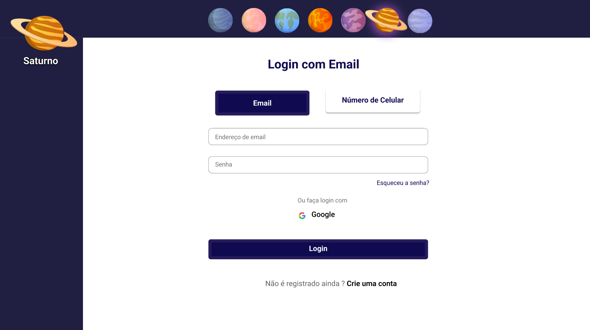

```bash
npm run dev
# or
yarn dev
# or
pnpm dev
# or
bun dev
```

Open [http://localhost:3000](http://localhost:3000) with your browser to see the result.

<h1 align="center"> ERP Eccomerce Saturno </h1>

<p align="center">
Desenvolvido por Guilherme de Carvalho<br>Estudante de Análise e Desenvolvimento de Sistemas<br> FATEC -Bragança Paulista <br/>


## 🚀 Tecnologias

Esse projeto foi desenvolvido com as seguintes tecnologias:

- Next JS
- JavaScript
- CSS
- Typescript
- Node JS

## 💻 Projeto

https://next-project-seven-kappa.vercel.app/ <br><br> O projeto é um protótipo de uma loja online (eccomerce) de um ERP
###


## :memo: Licença

Esse projeto está sob a licença MIT.
<p align="center">
  
</p>

<p align="center">
Feito com ♥ por Guilherme de Carvalho :wave: 
</p>